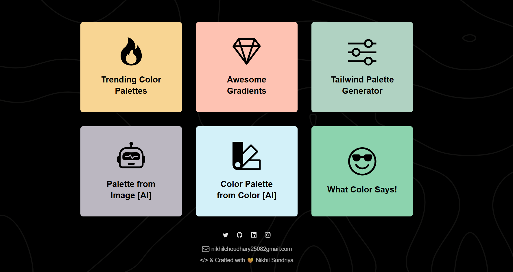
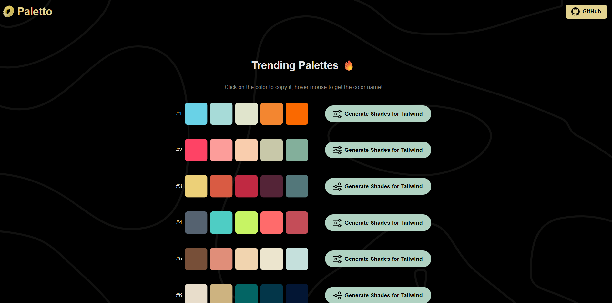
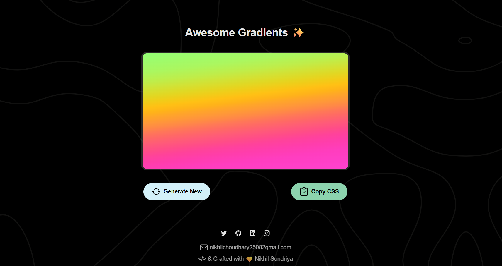
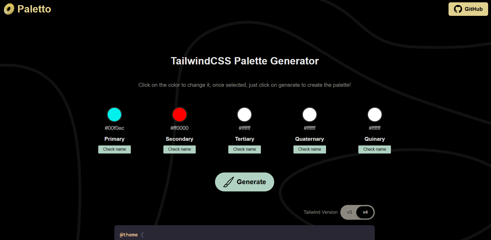
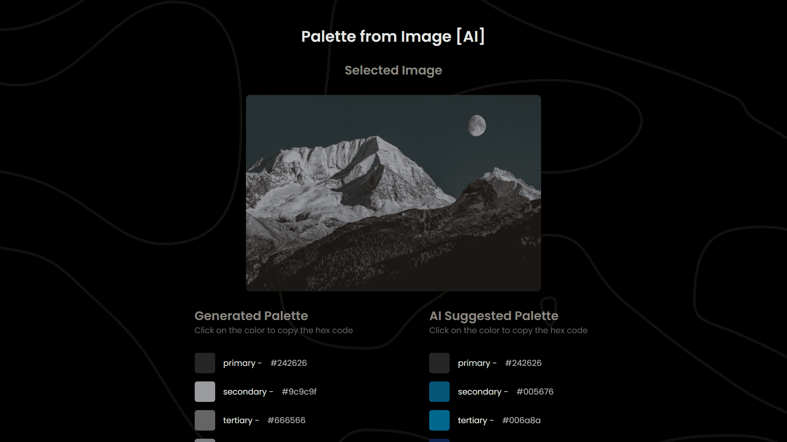
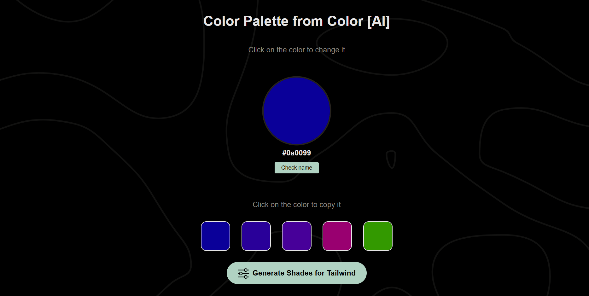
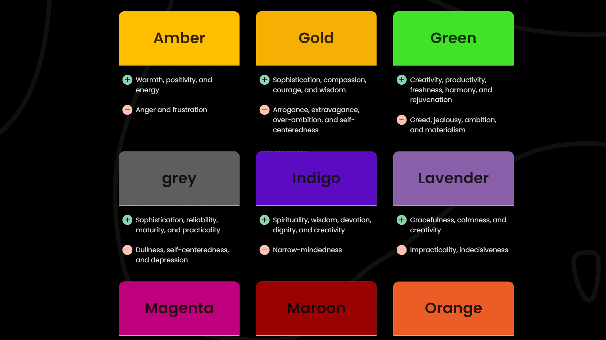

<div align="center">
 <h1> <br/>Paletto : Color Palette & Design Tool</h1>
 <a href="https://www.buymeacoffee.com/nikhilsundriya" target="_blank"></a>
 
  
 
 
</div>
<br/>




# Features
Design heavily relies on color, and selecting an ideal color palette can be overwhelming. Fortunately, Paletto provides a set of fantastic tools that let you unleash your creativity and bring your designs to life. Paletto's distinguishing features include:

### ⭐ Trending Color Palettes:
Paletto's Trending Color Palettes feature keeps you up-to-date with the latest color trends. It helps you choose the most popular colors for your project, whether you're designing a website, marketing campaign, or product. Additionally, you can tailor the palettes to your preferences using Paletto's user-friendly interface.



### ⭐ Awesome Gradients:
With Paletto's Awesome Gradients feature, you can effortlessly produce countless gradients. Gradients enhance the depth and texture of designs, making them more visually appealing. You can experiment with multiple color combinations and develop gradients that match your design requirements.



### ⭐Tailwind Palette Generator:
Paletto's Tailwind Palette Generator feature is custom-made for Tailwind CSS developers. By clicking once, you can create color palettes for your next Tailwind-powered project. This feature saves you time and effort when choosing colors that align with Tailwind's design system.



### ⭐ Palette from Image [AI]:
Paletto's Palette from Image [AI] feature uses artificial intelligence to analyze an image or logo's colors and create a color palette that complements it.



### ⭐ Color Palette from Color [AI]:
Paletto's Color Palette from Color [AI] feature generates a color palette from a single color.



### ⭐ What Color Says!:
Paletto's What Color Says! feature explains the psychology of color and how different colors can impact emotions and behavior.



## Our Social Links
[](https://linkedin.com/in/nikhilsundriya)
[](https://twitter.com/nikhil_sundriya)
[](https://instagram.com/nikhil_choudhary25)


## Tech Used


<details>
<summary>
  NextJS Guide
</summary>

## Getting Started

First, run the development server:

```bash
npm run dev
# or
yarn dev
```

Open [http://localhost:3000](http://localhost:3000) with your browser to see the result.

You can start editing the page by modifying `pages/index.js`. The page auto-updates as you edit the file.

[API routes](https://nextjs.org/docs/api-routes/introduction) can be accessed on [http://localhost:3000/api/hello](http://localhost:3000/api/hello). This endpoint can be edited in `pages/api/hello.js`.

The `pages/api` directory is mapped to `/api/*`. Files in this directory are treated as [API routes](https://nextjs.org/docs/api-routes/introduction) instead of React pages.

## Learn More

To learn more about Next.js, take a look at the following resources:

- [Next.js Documentation](https://nextjs.org/docs) - learn about Next.js features and API.
- [Learn Next.js](https://nextjs.org/learn) - an interactive Next.js tutorial.

You can check out [the Next.js GitHub repository](https://github.com/vercel/next.js/) - your feedback and contributions are welcome!

## Deploy on Vercel

The easiest way to deploy your Next.js app is to use the [Vercel Platform](https://vercel.com/new?utm_medium=default-template&filter=next.js&utm_source=create-next-app&utm_campaign=create-next-app-readme) from the creators of Next.js.

Check out our [Next.js deployment documentation](https://nextjs.org/docs/deployment) for more details.
  
</details>
